=== Architecture

*The diagram below describes the capabilities of Red Hat CloudForms Management Engine. Its features are designed to work together to provide robust management and maintenance of your virtual infrastructure.

.Features
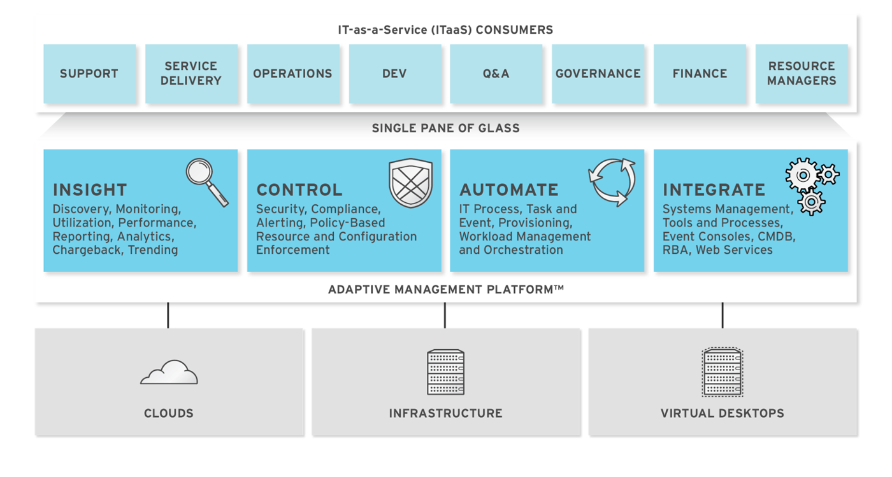

* The architecture comprises the following components:
** The CloudForms Management Engine Appliance (Appliance) which is supplied as a secure, high-performance, preconfigured virtual machine. It provides support for Secure Socket Layer (SSL) communications.
** The CloudForms Management Engine Server (Server) resides on the Appliance. It is the software layer that communicates between the SmartProxy and the Virtual Management Database. It includes support for Secure Socket Layer (SSL) communications.
** The Virtual Management Database (VMDB) resides either on the Appliance or another computer accessible to the Appliance. It is the definitive source of intelligence collected about your Virtual Infrastructure. It also holds status information regarding Appliance tasks.
** The CloudForms Management Engine Console (Console) is the Web interface used to view and control the Server and Appliance. It is consumed through Web 2.0 mash-ups and web services (WS Management) interfaces.
** The SmartProxy can reside on the Appliance or on an ESX Server. If not embedded in the Server, the SmartProxy can be deployed from the Appliance. Each storage location must have a SmartProxy with visibility to it. The SmartProxy acts on behalf of the Appliance communicating with it over HTTPS (SSL) on standard port 443.

NOTE: Reference link:https://access.redhat.com/documentation/en-US/CloudForms/3.0/html/Management_Engine_5.2_Settings_And_Operations/Architecture2.html[https://access.redhat.com/documentation/en-US/CloudForms/3.0/html/Management_Engine_5.2_Settings_And_Operations/Architecture2.html]

=== Cloudforms Appliance Allocations
==== CFME Appliance System Requirements
* POC CFME Appliance:
** 1x CFME Appliance:
*** 2 vCPU
*** 8 GB of RAM
*** 1x 40 Root Vol Disk
*** 1x 100GB DB Disk
*** 1x Network Interface

NOTE: link:../docs/Simplified-CFME-VMDB-Region-Zone-Global-Size-Estimator.ods[Simplified-CFME-VMDB-Region-Zone-Global-Size-Estimator]

=== CFME Appliance Setup
==== Initial Setup
. Download the CFME appliance from the Red Hat Customer Portal (login required). The CFME appliance is available as an OVA (Open Virtualization Format) file from: Download Software > Red Hat Enterprise Linux (v. 6 for 64-bit x86_64) > Red Hat CloudForms Management Engine (v5.2) > VMware Virtual Appliance.
. Upload the OVA file to the VMware Datastore and create the appliances virtual machines using this file. Convert the virtual machine into a template and use it to create all the appliances.

NOTE: To increase performance, increase the default 4 vCPUs/6GB RAM appliance configuration to 4 vCPUs/8GB RAM for the Web UI appliance and 4 vCPUs/8GB RAM for the DB and the Worker appliances.

==== Network Configuration
* Once started, the appliances need to be configured with basic network settings using the virtual serial console in the VMware client. Login as *admin / smartvm* and press Enter to go to the Advanced Settings menu.  Set Static Network Configuration, Set Hostname, Set Timezone, Date, and Time. When done entering the settings, select Summary Information to review.
* Host & IP Allocations

[width="100%",options="header"]
|======================
| Host      |   IP Address | Netmask | Gateway | DNS Server | Notes
| zp11000.mcip.usmc.mil | 10.1.101.10 |  255.255.252.0 | 10.1.101.1 | 10.1.100.130, 10.1.100.131 | CFME UI Appliance
| zp11001.mcip.usmc.mil | 10.1.101.11 |  255.255.252.0 | 10.1.101.1 | 10.1.100.130, 10.1.100.131 | CFME UI Appliance
| zp11002.mcip.usmc.mil | 10.1.101.12 |  255.255.252.0 | 10.1.101.1 | 10.1.100.130, 10.1.100.131 | CFME Worker Appliance
| zp11003.mcip.usmc.mil | 10.1.101.13 |  255.255.252.0 | 10.1.101.1 | 10.1.100.130, 10.1.100.131 | CFME Worker Appliance
| zp11004.mcip.usmc.mil | 10.1.101.14 |  255.255.252.0 | 10.1.101.1 | 10.1.100.130, 10.1.100.131 | CFME Worker Appliance
| zp11005.mcip.usmc.mil | 10.1.101.15 |  255.255.252.0 | 10.1.101.1 | 10.1.100.130, 10.1.100.131 | CFME Worker Appliance
| zp11006.mcip.usmc.mil | 10.1.101.16 |  255.255.252.0 | 10.1.101.1 | 10.1.100.130, 10.1.100.131 | CFME Worker Appliance
| zp11007.mcip.usmc.mil | 10.1.101.17 |  255.255.252.0 | 10.1.101.1 | 10.1.100.130, 10.1.100.131 | CFME Worker Appliance
| zp11008.mcip.usmc.mil | 10.1.101.18 |  255.255.252.0 | 10.1.101.1 | 10.1.100.130, 10.1.100.131 | CFME Worker Appliance
| zp11009.mcip.usmc.mil | 10.1.101.19 |  255.255.252.0 | 10.1.101.1 | 10.1.100.130, 10.1.100.131 | CFME DB Appliance
|======================

==== Hostname Configuration
.. Select Option 4
.. Set the hostname of the CFME appliance.  Refer to the table in Network Configuration section

==== Database Configuration
* With the new appliance the Database is not shipped configured by default. There will need to be a separate Database disk created outside of the appliance and then connected once the appliance has been started. In this case, after looking at where the current VM count and number of VM's that will be coming over the next few years the Database has been sized to 100GB. This will allow for growth over the next few years.

NOTE: The database uses LVM and storage can be extended at a later time

.. On the main console window select Option 10 (To Configure Database)
.. Select 1) Internal
.. Select 1) /dev/sdb
.. Input Region *10* for the Region Selection
.. Press *Enter*

[width="100%",options="header"]
|======================
| Region Name  |   Region #  | Notes
| Charlotte | 10     | POC to Production
| DBRegion | 99     | Optional: When Premier decides to scale to have DB Replication
|======================

=== Setup POC Cloudforms Appliance Roles
* Log in to the Cloudforms Web interface and go to Configure > Configuration > Select EVM Appliance > Server Tab
* Check the server roles using the following image as a guide

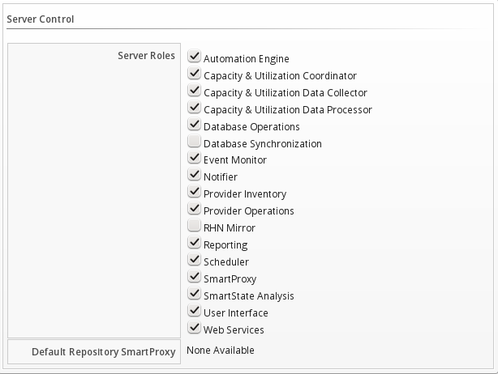

=== Database Backups

Database backups are scheduled to occur daily at 2AM CST. Backups are saved to an NFS volume.

|=========================================================
| NFS Volume Location | nfs://10.1.130.3:/vol/cf_nfs_data1
| Frequency | Daily
| Time | 02:00 CST
|=========================================================

image:images/screenshots/db_backup_schedule.png[] // placeholder

=== Access URL
[width="100%",options="header"]
|======================
| UI URL
| https://c3pucfme1.premierinc.com
|======================

=== Configure Zones
. Access the Web Interface and go to Configure > Configuration > Click on Zones
. In the right frame use the Configuration Icon then select "Add a new zone"

[width="100%",options="header"]
|======================
| Region Name  |   Region #  | Notes
| Charlotte | 10     | POC to Production
| DBRegion | 99     | Optional: When Premier decides to scale to have DB Replication
|======================

=== VMware Service Account
IMPORTANT: Need a CFME Service Account in order to access VMware vCenter and be able to provision and manage the vCenter environment from Cloudforms

NOTE: See the VMware documentation for instructions on how to create a role. This role will need to be associated with whatever credentials you enter for the Management System’s instance.

* From the Global group, check:
** Cancel task
** Diagnostics
** Log Event
** Set custom attribute
** Settings

* The entire set of privileges for the following groups should be checked.
** Alarms
** Datastores
** dvPort Group
** Host
** Network
** Resource
** Scheduled Task
** Tasks
** Virtual Machine
** vSphere Distributed Switch

In addition, you must also have the following objects and new role in place:

** Datacenter: At the Datacenter the CloudForms Management Engine (CFME) (formerly EVM) user/group must have at least the read-only role at the Datacenter level (Not Propagated) to be able to see the datacenter. Without this access, relationships cannot be made. Specifically, the datastores will not show up.
** Cluster: Each Cluster that the CFME needs access to must have the new role assigned and propagated.
** Folders: Each Folder that CFME needs access to must have the new role assigned and propagated.
** Datastores: Each Datastore that CFME needs access to must have the new role assigned and propagated.
** Networking: Each vLAN or Port Group that CFME needs access to must have the new role assigned and propagated.

NOTE: For latest update on this section refer to link:https://access.redhat.com/site/articles/320543[Creating Role for CFME in VMware] article in Customer Portal

=== Install VMware VDDK
The integration of the VMware VDDK (Virtual Disk Development Kit) optimizes the execution of SmartState Analysis on Virtual Machines and is required for CFME Appliances to successfully collect insight information within VMware vCenter. The VDDK can be downloaded from the VMware website with a valid customer account.

. Download the VDDK 1.2.2 from VMware's website at https://my.vmware.com
. Download the file VMware-vix-disklib-5.1.1-1042608.x86_64.tar.gz
. Copy the file to the /root folder of the CFME Appliances
. Start an SSH session into the CFME Appliance
. Run the following commands to extract and install vmware vddk, accept defaults during the installation process:
----
cd /root
tar xvzf VMware-vix-disklib-5.1.1-1042608.x86_64.tar.gz
cd vmware-vix-disklib-distrib
./vmware-install.pl
----
[start=6]
. Once the VDDK is installed, run the ldconfig command in order for EVM to find the newly installed vddk library.:
----
ldconfig
----
[start=7]
. Reboot the CloudForms Appliance. The VDDK is now installed on the CFME appliance.

NOTE: Reference: link:https://access.redhat.com/knowledge/articles/329683[https://access.redhat.com/knowledge/articles/329683]

=== User Roles

[format="csv",width="100%",cols="4,^2,^2,^2,^2",options="header"]
|======
include::../docs/CFME-rolematrix.csv[]
|======

NOTE: link:../docs/CFME-rolematrix.xls[CFME-rolematrix.xls] or link:../docs/CFME-rolematrix.xls[CFME-rolematrix.csv]

=== Associate Cloudforms Appliance as a VM within vCenter Provider
In order for Cloudforms to know which appliance is which VM to execute certain jobs it needs to be associated
* Go to Infrastructure > Virtual Machines > Search for <appliance name> (i.e. c3pucfme1)  > Click on VM
* In the VM object view Use the VM Configuration menu > Select Edit Management Engine Relationship

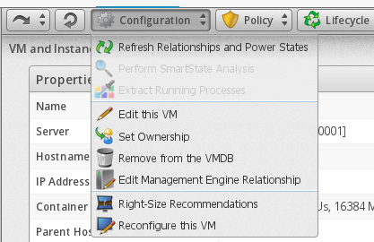

* Use the drop down menu to associate the EVM appliance that matches up with this VM.  (i.e. EVM10000000000001)

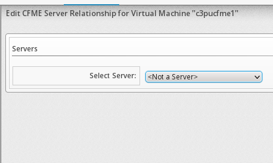

* Click on Save

=== Configure NTP Server
* Go to Configure > Configuration > Select EVM Server > Click on Server Tab > Enter NTP Information
[width="80%",options="header"]
|======
| Label |  value
| Servers | 10..1.100.130
| Servers | 10..1.100.131
|======

* Click on Save

=== Configure outgoing E-mail settings
To use the email action in CloudForms Management Engine, you need to set an email address that you will have the emails sent from.

NOTE: To be able to send any emails from the server, you must have the Notifier Server role enabled. You can test the settings without the role enabled.

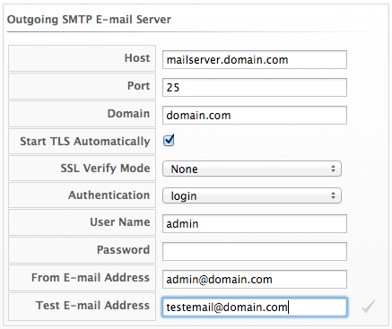

* Environment Specific Settings:
[width="50%", cols="4,6", options="header"]
|======
| Label |  value
| Host | mailhost.premierinc.com
| Port | 25
| Domain | premierinc.com
| Start TLS Automatically | <NOT checked>
| SSL Verify Mode | None
| Authentication | none
| User Name | <blank>
| Password |  <blank>
| From E-mail Address | cloudforms@corp.premierinc.com
| Test E-mail Address |
|======

* Use Host to specify the host name of the mail server.
* Use Port to specify the port for the mail server.
* Use Domain to specify domain name for the mail server.
* Check Start TLS Automatically if the mail server requires TLS.
* Select the appropriate SSL Verify Mode.
* Use the Authentication drop down to specify if you want to use login or plain authentication.
* Use User Name to specify the user name required for login authentication.
* Use Password to specify the password for login authentication.
* Use From Email Address to set the address you want to send the email from.
* Use To Email Address if you want to test your email settings.
* Click on Save

=== Register Appliance
==== Editing Customer Information
The Red Hat Updates page allows the user to edit customer information.

* To edit customer information

** Navigate to Configure → Configuration.
** Click on the Settings accordion, then Region, then click on the Red Hat Updates tab.
** Click Edit Registration in the Customer Information area
** The Customer Information area will display options to edit registration, User ID and Password.
*** Register to field provides options for the Customer Portal, RHN Satellite v5 for Red Hat Satellite 5.x servers, and RHN Satellite v6 for Red Hat Satellite 6.x servers. If switching to RHN Satellite v5 or v6, the page will refresh and a prompt for a Server URL will be included in the Customer Information area.
*** The HTTP Proxy area displays options to enable usage of the HTTP Proxy.
*** The User ID and Password are the customer account details for the Customer Portal or Satellite.

NOTE: Reference link:https://access.redhat.com/documentation/en-US/CloudForms/3.0/html/Management_Engine_5.2_Installation_Guide/chap-Registering_and_Updating_CloudForms_Management_Engine.html[https://access.redhat.com/documentation/en-US/CloudForms/3.0/html/Management_Engine_5.2_Installation_Guide/chap-Registering_and_Updating_CloudForms_Management_Engine.html]

=== AD Integration
==== Go to the LDAP Configuration Page:
===== Configure > Settings > Select EVM Server > Select Authentication Tab
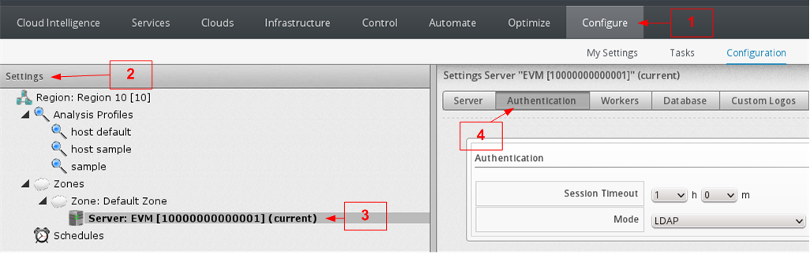

==== Fill out the LDAP Settings

* Set the Session Timeout and Mode
[width="80%", cols="3,7"]
|======
| Session Timeout: |  [ 1 ]h [ 0 ]m
| Mode: | LDAPS
|======

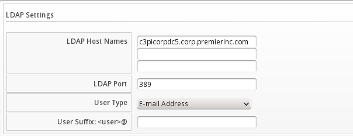

* Set the LDAP Settings
[width="80%",cols="3,7"]
|======
| LDAP Host Names: |  10.1.100.130 10.1.100.131
| LDAP Port: | 636
| User Type: | User Principle Name
| User Suffix: <user>@ | mcip.usmc.mil
|======

* Set the Role Settings
[width="80%", cols="3,7"]
|======
| Get User Groups from LDAP |  <Checked>
| Get Roles from Home Forest | <Checked>
| Follow Referrals | <Checked>
| Base DN: | DC=mcip,DC=usmc,DC=mil
| Bind DN: | cf.cloud.svc@mcip.usmc.mil
| Bind Password: | <See Premier's Password for this user>
|======
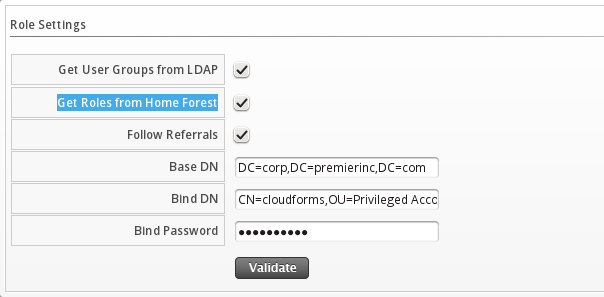

* Click [ Validate ]

* Click on Save button at the bottom right of the page

=== Add Openstack Provider
After initial installation and creation of a CloudForms Management Engine environment, add cloud providers with the following procedure.

* Navigate to Clouds → Providers.
* Click (Configuration), then click (Add a New Cloud Provider).
* Enter a Name for the provider.
* Select the OpenStack in the Provider field
* Fill out the Credentials by typing in a User ID, Password, and a verification of this password (Verify Password).
** If editing an OpenStack provider, use the AMQP subtab to provide credentials required for the Advanced Message Queuing Protocol service on your OpenStack Nova component.
* Click Validate to validate the credentials.
* Click Add.

=== Add VMware Provider
After initial installation and creation of a CloudForms Management Engine environment, add providers to the appliance with the following procedure.

* Navigate to Infrastructure → Providers.
* Click (Configuration), then click (Add a New Infrastructure Provider).
* Type in the Name of the provider to add. The Name is how the device is labeled in the console.
* Select the Type of provider: VMware vCenter.
* Type in the Host Name, and IP Address of the provider to add.
* Type in a User ID and Password with administrator privileges to the provider. To refresh a provider, these credentials are required.
* Click Validate to confirm that the user and password connects.
* Click Save.

=== DNS Integration with Infoblox

==== Login Information
* URL: https://10.32.2.200/ui/
* Username: *cloudforms*
* Password: <See Password Sheet with Customer>

==== Infoblox Access Information

==== Infoblox Provisioning Workflow

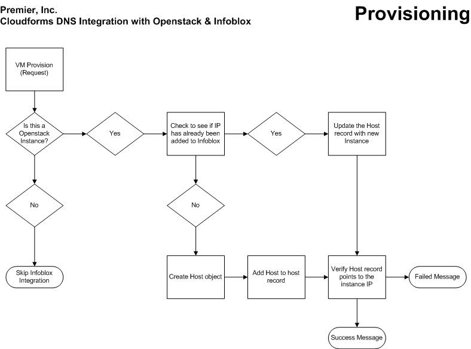

NOTE: Source: link:../cloudforms/infoblox_integration/infoblox_integration_workflow.vsd[VSD]

==== Infoblox Retirement Workflow

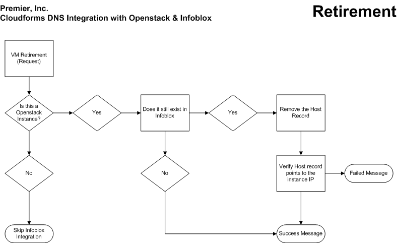

NOTE: Source: link:../cloudforms/infoblox_integration/infoblox_integration_workflow.vsd[VSD]

==== Infoblox Automate Overview

/PremierHealthcare::
/Integration:::

+
/Infoblox_DNS_Entry::::

* Instances:
** Infoblox_DNS_Alias
** Infoblox_Dialog_List_Networks
** Infoblox_Host_Record
** Infoblox_Delete_Record
** Infoblox_Instance_Provision
** Infoblox_Instance_Retire
** Infoblox_Instance_Verify

* Class Schema:

[width="100%",options="header"]
|======
| Name | Type | Data Type | Default Value | Display Name | Description | Sub | Collect | Message | On Entry | On Exit | On Error | Collect | Max Retries | Max Time
| servername | Attribute |  String | infoblox.example.com | | | [x] | | create | | | | | |
| username | Attribute |  String | cloudforms | | | [x] | | create | | | | | |
| password | Attribute |  Password | | | | [x] | | create | | | | | |
| to_email_address | Attribute |  String | | | | [x] | | create | | | | | |
| from_email_address | Attribute |  String | | | | [x] | | create | | | | | |
| signature | Attribute |  String | | | | [x] | | create | | | | | |
| action | Attribute |  String | | | | [x] | | create | | | | | |
| gateway | Attribute |  String | | | | [x] | | create | | | | | |
| subnet | Attribute |  String | | | | [x] | | create | | | | | |
| domain | Attribute |  String | | | | [x] | | create | | | | | |
| method1 | Method |  String | | | | [x] | | create | | | | | |
| method2 | Method |  String | | | | [x] | | create | | | | | |
|======

==== Methods:

===== Infoblox_DNS_Alias
[source,ruby]
----
include::../cloudforms/Datastore/PremierHealthcare/Integration/Infoblox_DNS_Entry/Infoblox_DNS_Alias.rb[Infoblox_DNS_Alias]
----

===== Infoblox_Delete_Record
[source,ruby]
----
include::../cloudforms/Datastore/PremierHealthcare/Integration/Infoblox_DNS_Entry/Infoblox_Delete_Record.rb[Infoblox_Delete_Record]
----

===== Infoblox_Dialog_List_Networks
[source,ruby]
----
include::../cloudforms/Datastore/PremierHealthcare/Integration/Infoblox_DNS_Entry/Infoblox_Dialog_List_Networks.rb[Infoblox_Dialog_List_Networks]
----

===== Infoblox_Host_Record
[source,ruby]
----
include::../cloudforms/Datastore/PremierHealthcare/Integration/Infoblox_DNS_Entry/Infoblox_Host_Record.rb[Infoblox_Host_Record]
----

=== Import Control Policies, Profiles, Alerts
* Go to Control > Import/Export
* Click on "Browse" and select the local file to upload
* Click Upload
* Next page will populate showing you all of the items that will be imported
* Click on "Commit"

Do the previous steps for each of the files in the next 3 sections.

==== Policies.yaml
Link: link:../cloudforms/Control_Import/Policies.yaml[Policies.yaml]

Source:
----
include::../cloudforms/Control_Import/Policies.yaml[]
----

==== Profiles.yaml
Link: link:../cloudforms/Control_Import/Profiles.yaml[Profiles.yaml]

Source:
----
include::../cloudforms/Control_Import/Profiles.yaml[]
----

==== Alerts.yaml
Link: link:../cloudforms/Control_Import/Alerts.yaml[Alerts.yaml]

Source:
----
include::../cloudforms/Control_Import/Alerts.yaml[]
----

=== Database Backup Procedure
There are two way to perform backups.

1) RECOMMENDED: This method is done through the Web UI and allows you to set up schedules and to have the backups be on an NFS or Samba share.

2) Manually through the DB Appliance SSH session

==== Web UI: Single Run Database Backup
* Go to Configure > Configuration > Diagnostics (Left hand navigation menu) > Select Region (i.e. Region 10) > Click on Database Tab
* in the Database Backup Settings enter the following:

[width="100%"]
|======
| Type: | Network File System
| URI: nfs:// | c3pudrnas1:/drnas/cloudforms
|======

* Click on Submit

* Click OK in the pop-up "Are you sure you want to Run a Database Backup Now?"

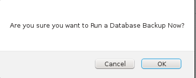

==== Web UI: Scheduled Database Backup

* Go to Configure > Configuration > Settings > Select Schedules within the Left Hand Menu

image:../cloudforms/database/menu.png[]

* Fill out the settings as show in the image

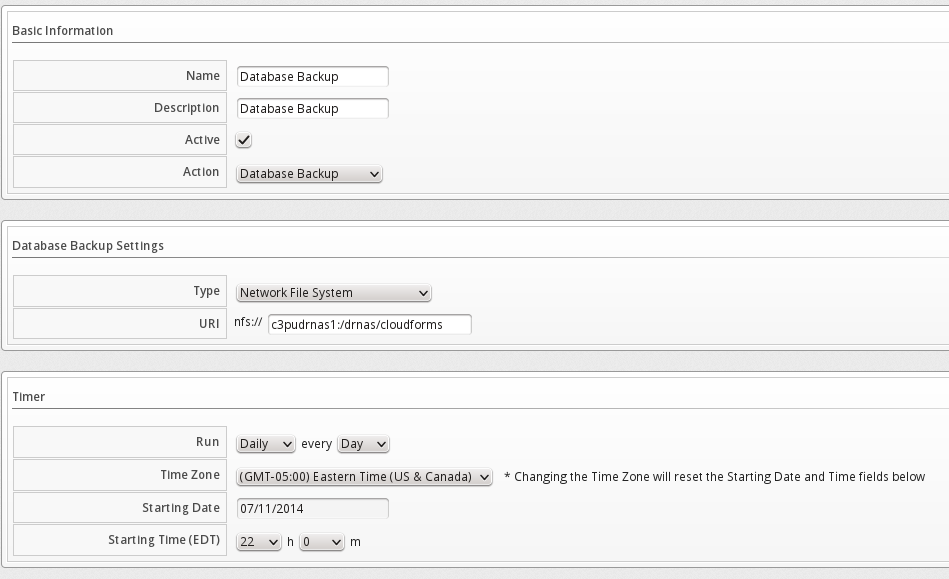

* Click Add

==== SSH: Manual Database Backup
* SSH into the appliance

* switch to postgres user
----
su - postgres
----

* Run backup command
----
pg_dump vmdb_production | gzip > /tmp/postgres_db_backup.gz
----

* To restore
----
cat /tmp/postgres_db_backup.gz | gunzip | psql vmdb_production
----

=== Member Groups

==== Creating/Importing Group from LDAP/Active Directory
* Go to Configure > Configuration > Access Control > Click on Groups

* Click on the Configuration Button > Select Add New Group

* In the Group Information enter the following:

[width="100%"]
|======
| Description: | <Name of LDAP Group>
| Role: | <Select appropiate Role that was created>
|======

* Select Filters for this group on the right.

* Click on Save

IMPORTANT:  The filters selected is what will determine what objects the user in this group will be able to see.  Example:  If the user is part of Department A, and you select "Department > Department A" this user will only EVER see any objects that are tagged with the "Department A" tag.

Example:

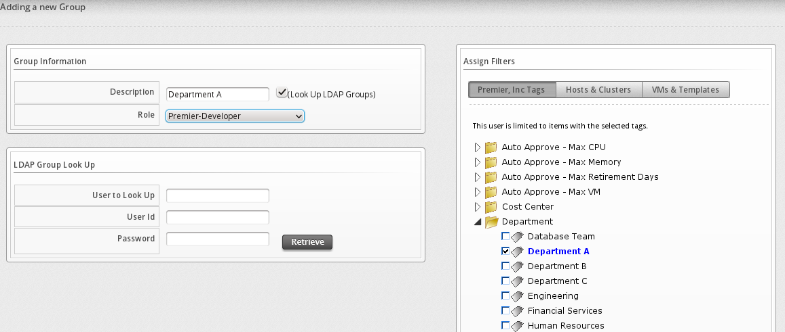

NOTE:  You may also leave the Description Blank and then check the "(Look Up LDAP Groups)" check-box and in the "LDAP Group Look Up" section enter a User to Look up and use your LDAP user / password to retrieve all of the groups this member is a part of.  Then select from the Drop Down in "Group Information" with the according LDAP/AD Group that you want to create.   Once the group is select it will automatically replace the contents of the "Description" Field.  After this is done, select the according Filters on the right side.

==== Adding Smart Management Tag to Group
* Select the Group that was previously created
* Click on Policy
* Click on "Edit Premier, Inc's Tags for this Group"
* in the "Select a customer tag to assign" select Department, then select the appropiate Department
* in the "Select a customer tag to assign" select Cost Center, then select the appropiate Cost Center

Example:

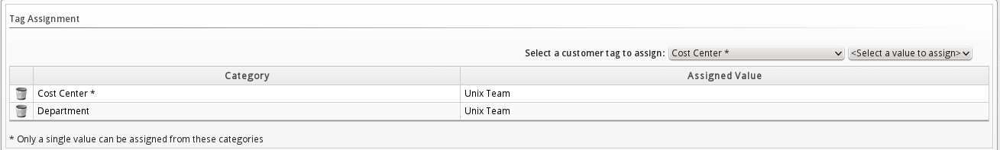

* Click Save

==== Groups created during Engagement

[width="100%", options="headers"]
|======
| Group Name | Role | Tag: Cost Center | Tag: Department | Filters | Notes
| Unix Admins | Premier-Admin | Unix Team | Unix Team | None | No Tags or Filters are created in order to assure the admins can see ALL resources
| ITS Unix Admins | Premier-Admin | Unix Team | Unix Team | None | No Tags or Filters are created in order to assure the admins can see ALL resources
| ITS Server Team | Premier-Developer | Department A | Department A | Department A | This will only allow this group to view only objects/resources tagged with Department A
|======

* NOTE: The Smart Management Tags added to groups will make it so that when these users in these groups provision any Instances/VM's it will automatically tag the Instances/VM's with the provided tags

=== Tag Taxonomy
include::cloudforms_tags.adoc[]

=== Service Catalog

==== Create new Catalogs
* Go to Services > Catalog > Click on "Catalogs" menu on the left hand side
* Click the "Configuration" Button
* Select "Add a New Catalog"
* Enter the Name of the Catalog
* Enter the Description of the Catalog

==== Create New Catalog Item
* Go to Services > Catalog > Click on "Catalog Items" menu on the left hand side
* Select the Catalog that was previously created
* Click the "Configuration" Button
* Select "Add a New Catalog Item"
* Should bring you to the "Basic Info" Tab

** Choose the Catalog Item Type, i.e. Openstack

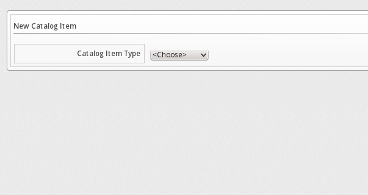

** Enter the Name and Description and Check the "Display in Catalog"

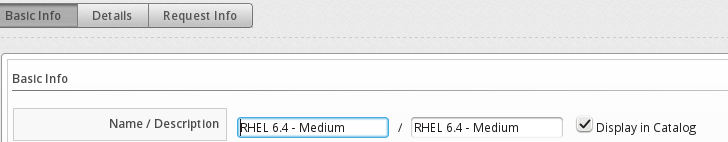

** Once the rest of the view is expanded Select the Catalog. i.e. 001-Dev
** Select the Dialog i.e. Basic VM
** Provisioning Entry Point (NS/Cls/Inst): /Factory/StateMachines/ServiceProvision_Template/CatalogItemInitialization

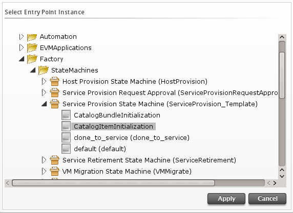

** Click Apply

** Retirement Entry Point (NS/Cls/Inst): /Factory/StateMachines/ServiceRetirement/Default

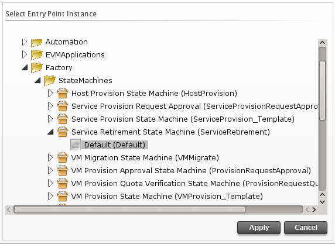

** Click Apply

* Click on the "Request Info" Tab

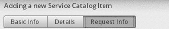

** Request Info: Catalog

*** Select Name of the Template (i.e. rhel6)
*** Enter Instance Name "changeme" (note: this will be changed later using the Service Dialog, just leave it as changeme

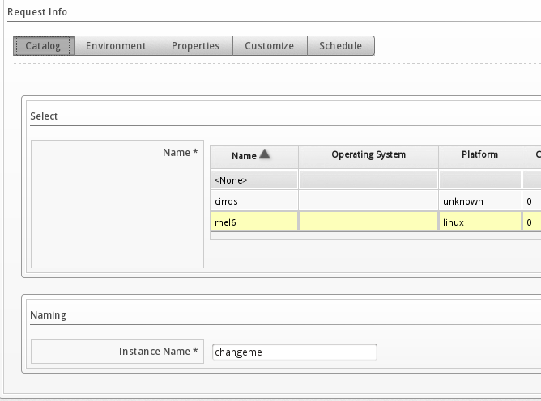

** Request Info: Click on the Environment Tab
*** Placement Options: Availability Zones: *nova*
*** Placement Options: Cloud Network: *publicnet*

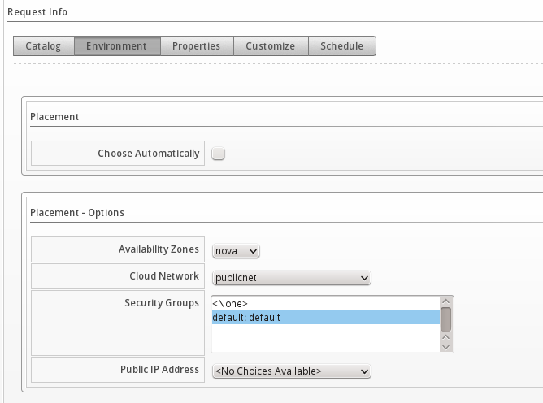

** Request Info: Click on the Properties Tab
*** Properties: Instance Type: i.e. m1.medium
*** Properties: Guest Access Key Pair: devops

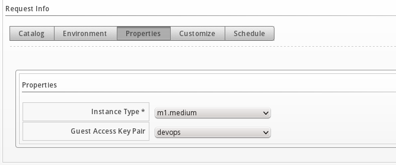

** Request Info: Click on the Schedule Tab
*** Schedule: Time until Retirement: i.e. Indefinite

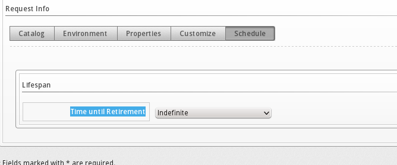

* Click Add

==== Change the Catalog Item Custom Image
* Select the Catalog Item to upload a custom image to
* Click on Browse and select Image to use

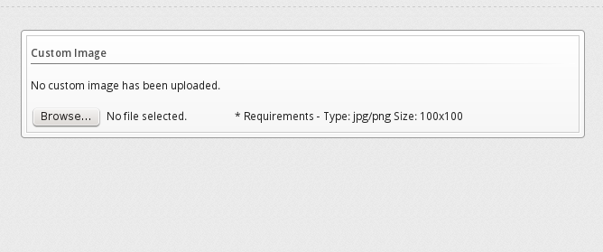

* Now you will see the custom image for the Catalog Item be updated

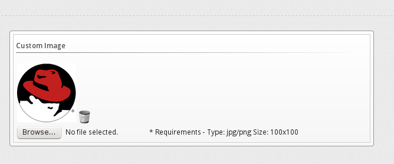

==== Create New Catalog Bundle
* Go to Services > Catalog > Click on "Catalog Items" menu on the left hand side
* Select the Catalog that was previously created
* Click the "Configuration" Button
* Select "Add a New Catalog Bundle"
* Should bring you to the "Basic Info" Tab

** Enter the Name and Description and Check the "Display in Catalog"

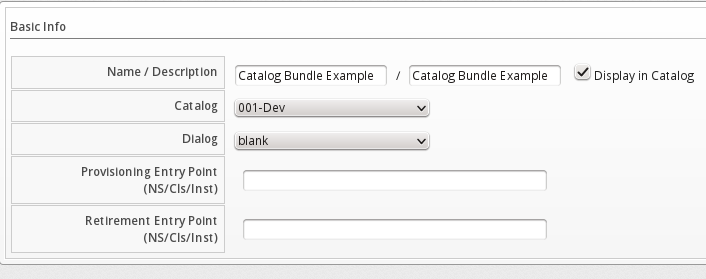

** Once the rest of the view is expanded Select the Catalog. i.e. 001-Dev
** Select the Dialog <Blank>

IMPORTANT:  You can select another Dialog, but you have to make sure it is for a Bundle and not a single Item)

** Provisioning Entry Point (NS/Cls/Inst): /Factory/StateMachines/ServiceProvision_Template/CatalogBundleInitialization

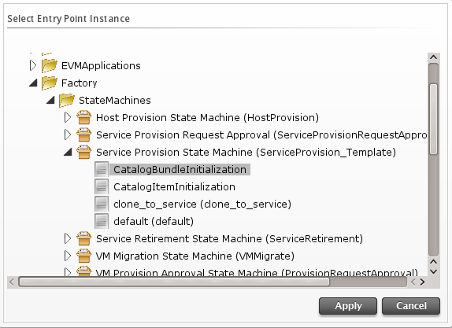

** Click Apply

** Retirement Entry Point (NS/Cls/Inst): /Factory/StateMachines/ServiceRetirement/Default

** Click Apply

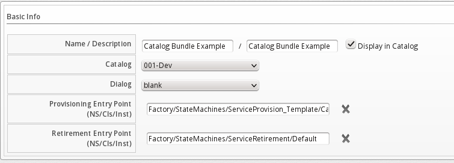

* Click on the "Resources" Tab

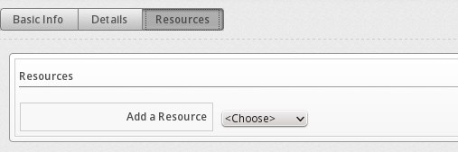

** Select an existing Catalog Item Resource (i.e. RHEL 6.4 - Small)

** Select an additional Catalog Item Resource (i.e. RHEL 6.4 - Medium)

** Repeat the previous 2 steps as many times as needed for all of the resources required for this bundle

** If needed, modify the Action Order or Provision Order:

NOTE: Provision Order will only worry about in which order it will actually provision the instance/vm.  The Action Order is done once the provisioning is completed it will then perform the action specified in that order.  Example:  You can have the same Provision Order, but only care about the order that things are powered on.

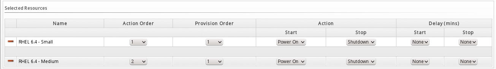

** In the above screenshot, "RHEL 6.4 - Small" will power on before "RHEL 6.4 - Medium"

* Click Add

=== Cloudforms: Appendix
==== Datastore Import File: link:../cloudforms/infoblox_integration/infoblox_integration.xml[infoblox_integration.xml]
[source,xml]
----
include::../cloudforms/automate_datastore/infoblox_integration.xml[XML]
----

